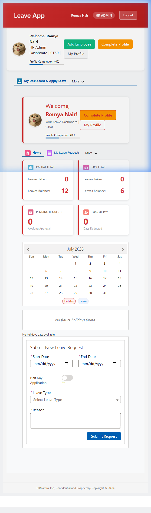
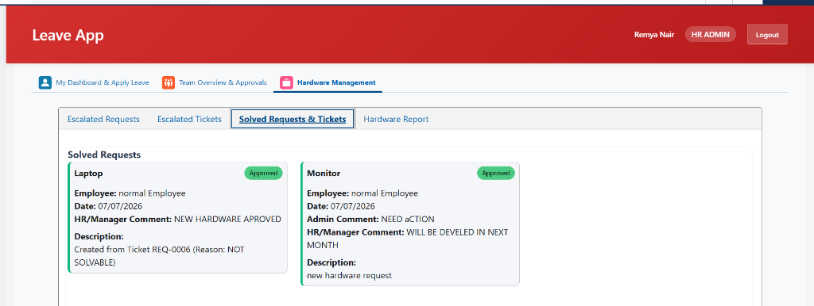
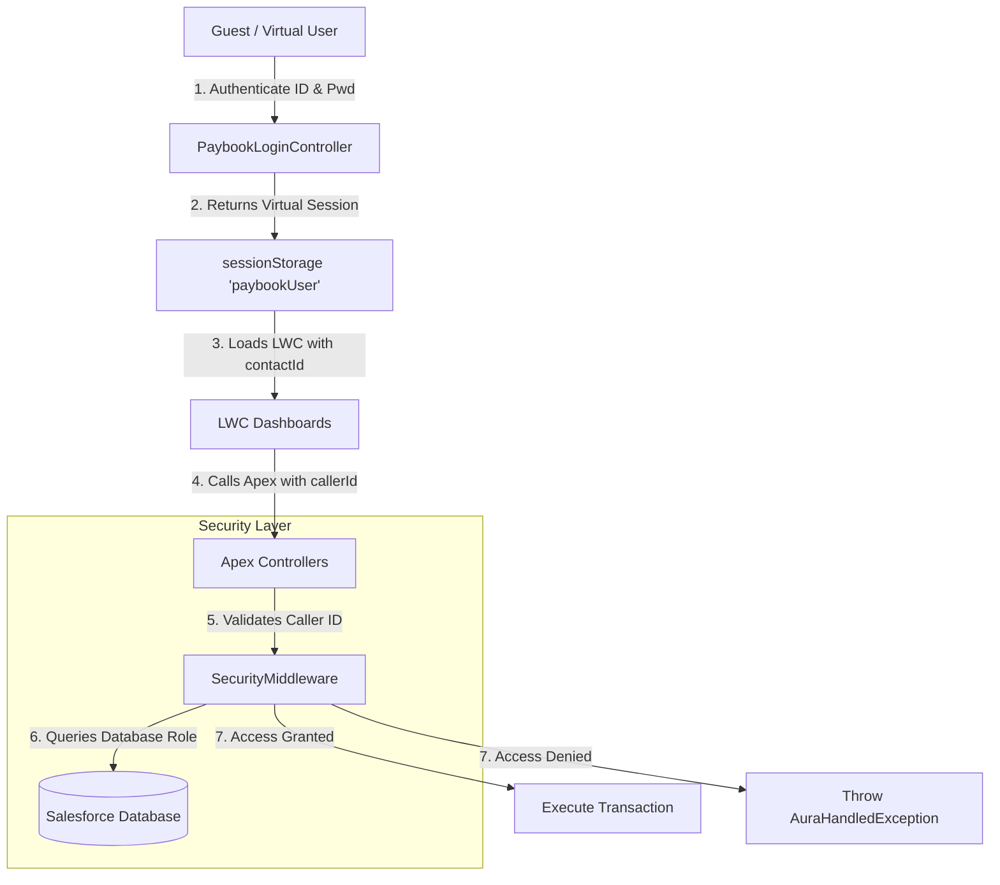

# 🌴 Leave & 💻 Hardware Management Portal

Welcome to the **Leave & Hardware Management App**—a modern, high-fidelity Employee Self-Service portal built natively on the Salesforce platform using high-performance **Lightning Web Components (LWC)** and a secure **Apex backend**.

Designed for enterprise-level operations, this portal streamlines employee leave planning, automates hardware request workflows, resolves hardware tickets, and enforces high-security server-side checks.

---

## 🎨 User Dashboards Preview

### HR Admin Dashboard
The comprehensive HR dashboard allows administrators to manage leave metrics, track employee statuses, allocate hardware inventory, and manage roles.


### Hardware Ticket-to-Request Conversion
Administrators can easily resolve hardware tickets and automatically spin up a new hardware request forwarded to HR for provisioning.


---

## 🚀 Key Portal Features

### 1. 🌴 Comprehensive Leave Management
* **Flexible Leave Types**: Supports Annual/Earned, Casual, Sick, Maternity (180 days), Paternity (5 days), Bereavement, and Marriage leave.
* **Smart Validation Engine**: Enforces gender-based maternity/paternity validation, automatically handles half-day requests (FN/AN sessions), and blocks overlapping dates.
* **Auto-Approval Hierarchy**: Managers approve employee requests, while HR approves manager requests and can directly mark leave for colleagues.

### 2. 💻 End-to-End Hardware Lifecycle
* **Self-Service Requests**: Employees can request new hardware (Laptops, Monitors, CPU, etc.) with reason details.
* **Ticketing Support**: Employees submit issue tickets for assigned hardware.
* **TSA & Admin Queues**: Technical System Admins (TSA) filter and queue tickets, forwarding them to HR or resolving them locally.
* **Admin Conversion Modal**: Convert employee issue tickets directly into a new **Hardware Request** forwarded to HR with one click.
* **Fulfillment & Delivery**: Approved hardware requests feature a **Deliver** action, changing status to `Fulfilled` and updating inventory.

### 3. 🛡️ Server-Side Security Middleware (Anti-Privilege Escalation)
* **Real-time Role Verification**: Validates the logged-in user directly against the database (`Portal_Access_Type__c` and `Is_Technical_System_Admin__c`).
* **Session Integrity**: Bypasses client-side session modifications (e.g. attempting to change local storage role to `HR Admin`) by re-validating the caller ID on every single server operation.
* **Secured Controllers**: Both `LeaveController.cls` and `HardwareController.cls` are audited and secured via a centralized `SecurityMiddleware.cls` interceptor.

### 4. ✉️ Trigger-Based Email Notifications
* Automatically fires transactional emails to the **Employee**, **Manager**, **HR**, and **Admin** on critical lifecycle events:
  * New hardware ticket or request submission.
  * Ticket-to-Request conversion.
  * Status updates (Approval / Rejection).
  * Delivery and fulfillment.

---

## 🗺️ System Architecture



---

## 🔑 Registered Sign-In Credentials

To test the application locally or inside your staging environment, use the virtual sign-in credentials listed below:

| Role | Employee ID | Default Password | Name |
| :--- | :--- | :--- | :--- |
| **HR Admin** | `CT50` | `Welcome@HR50` | Remya Nair |
| **Manager** | `CT01` | `Welcome@Manager01` | Harish Kumar |
| **Employee** | `CT432` | `WELCOME@CRMantra12` | normal Employee a |
| **System Admin (TSA)** | `CT101` | `WELCOME@CRMantra12` | system Admin |

---

## 🛠️ Deploying & Configuring the Project

Follow these steps to deploy the portal metadata and establish guest permissions in your Salesforce sandbox or Developer Edition org.

### Step 1: Deploy Metadata
Deploy the Apex controllers, triggers, Custom Objects, and Lightning Web Components using the Salesforce CLI:
```powershell
sf project deploy start
```

### Step 2: Grant Guest Profile Permissions
Because the virtual login page executes within the Experience Cloud **Guest User** context, the guest profile must have explicit access to the portal Apex classes:
1. Run the utility Apex script to automatically create `SetupEntityAccess` records:
   ```powershell
   sf apex run --file "grant_guest_access.apex"
   ```
2. Alternatively, navigate to **Setup** > **Digital Experiences** > **Pages** > Click **Leave_app** > Open the **Guest User Profile** and add the following classes to **Enabled Apex Class Access**:
   * `PaybookLoginController`
   * `PaybookSignupController`
   * `LeaveController`
   * `HardwareController`
   * `SecurityMiddleware`

---

## 🧑‍💻 Component Architecture

* **`paybookApp`**: Parent shell that manages login state, routing, and renders dashboards.
* **`paybookLogin`**: Renders the login form, handles password changes, OTP resets, and new registration.
* **`leaveEmployeeDashboard`**: Self-service portal for applying leaves, checking balances, raising hardware tickets, and checking statuses.
* **`leaveManagerDashboard`**: Manager view for reviewing leaves, approving/rejecting team requests, and tracking team attendance.
* **`leaveHRDashboard`**: HR view for marking leave, reviewing logs, checking analytics, updating roles, and processing hardware queues.
* **`hardwareAdminDashboard`**: Admin portal to update hardware status, assign serials, manage inventory, and convert issue tickets.
